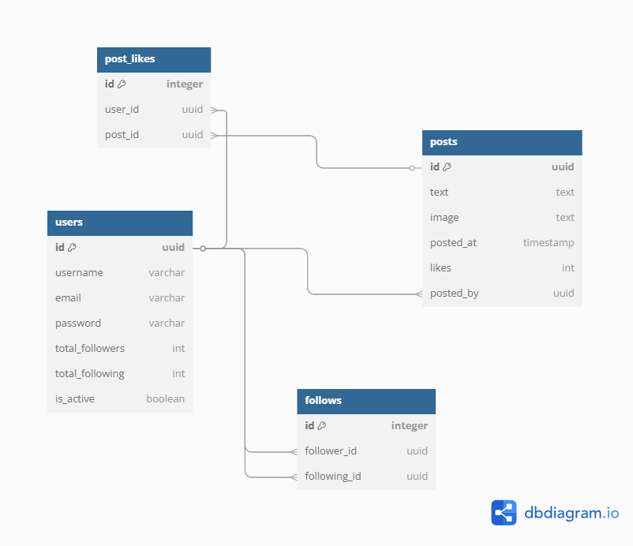

# Mini-twitter API (with Docker)

This is a Django REST API project with JWT authentication that simulates a Mini-Twitter platform, allowing users to create and like posts, follow or unfollow other users.


## 📦 Tecnologies

- Python 3.13
- Django
- Django REST Framework
- JWT
- Docker 


## 🧑‍💻 Use Cases

### 👨🏼‍🏫 CASE 1: User registration

Users can sign up by providing:
- Email
- Username
- Password

> **Endpoint:** `POST /user/create`

### ✍️ CASE 2: Post Creation

Authenticated users can create posts with: 
- Image
- Text

> **Endpoint:** `POST /post`

### 👥  CASE 3: Follow/Unfollow Users

Authenticated users follow or unfollow other users 

> **Endpoint:** `PATCH /follow or /unfollow`

### 📰  CASE 4: View Feed

Authenticated users an view a paginated list of posts from the users they follow

> **Endpoint:** `GET /feed `


## 🚀 How to run the project

```bash
1. git clone https://github.com/luisaferreirass/mini-twitter.git
2. cd your-repository
3. docker-compose up --build
4. docker-compose exec django-web python manage.py  makemigrations
5. docker-compose exec django-web python manage.py migrate
``` 
After that, you need to create your environment variables file (.env). Once that's done, the backend will be available at: http://localhost:8000

Feel free to create users, posts and follow or unfollow other users!

## 📌 Entity-Relationship Diagram (ERD)


## 📌 Architecture diagram

